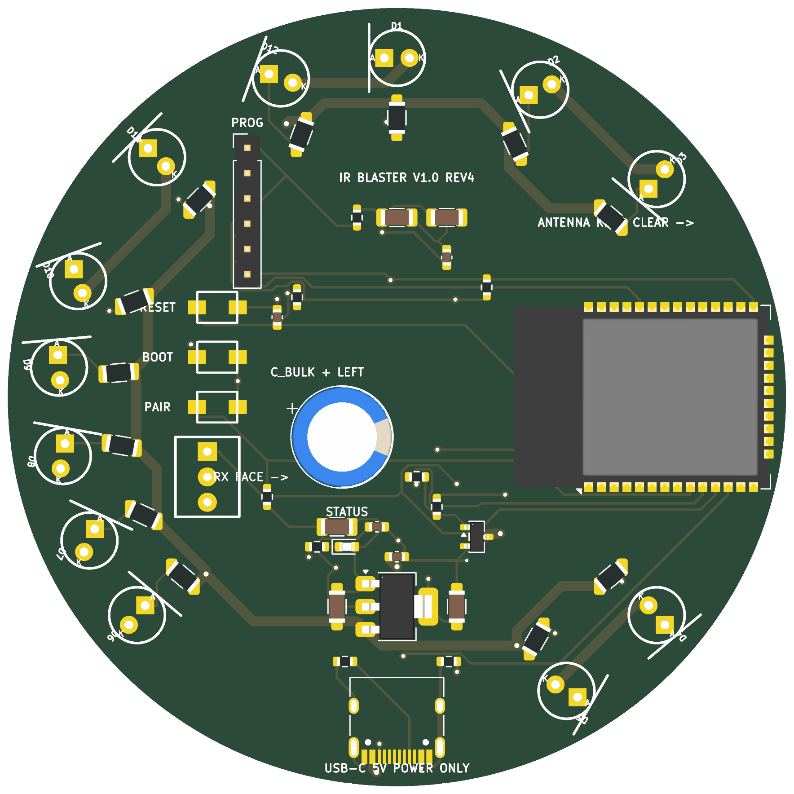

# IR Blaster HW V1.0 — REV4 complete

ESP32-WROOM-32E-N16、USB-C 5V入力、12灯IR送信、IR受信、操作ボタン、
試作用1x6書き込み端子、量産用2x3ポゴパッドを載せた直径78 mmの完成基板です。

標準の発注構成は **Hybrid PCBA** です。JLCPCBにはSMT部品だけを実装してもらい、
D1–D12、U_RX、C_BULK、J_PROGはDNP（未実装）にします。これらは後から手はんだします。

## そのまま使う発注ファイル

- `manufacturing/ir_blaster_v4_complete_gerbers.zip`
- `assembly/BOM_JLCPCB.csv`
- `assembly/CPL_JLCPCB.csv`
- 一括確認用 `release/ir_blaster_v4_complete_order_bundle.zip`
- 組立図 `docs/ir_blaster_v4_complete_assembly_drawing.pdf`
- 組立注記 `docs/ASSEMBLY_DRAWING.md`

## 検査結果

- KiCad 9 ERC: blocking error 0
- KiCad 9 DRC: blocking error 0 / unconnected 0
- 2層、FR-4、1.6 mm、1 oz、外形78 x 78 mm
- USB-Cは5 V給電専用。データ線は未接続、CC1/CC2は各5.1 kΩでGNDへ接続
- JLCPCB Gerber Viewerで2層・78 x 78 mmとして解析済み（2026-08-16）

発注操作の直前に `docs/PRE_ORDER_CHECKLIST.md` とJLCPCBの部品向きプレビューを確認してください。
